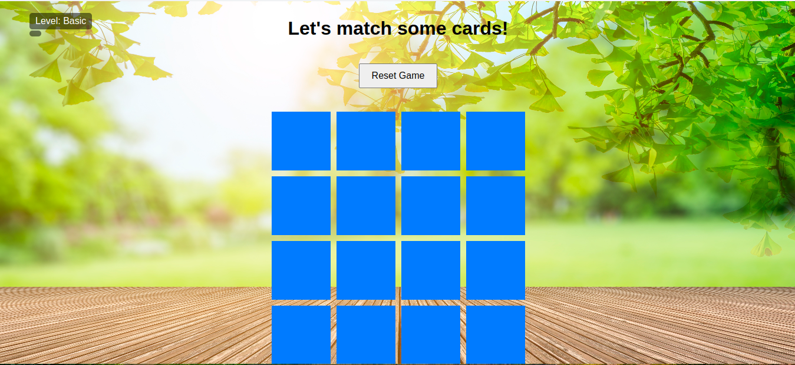
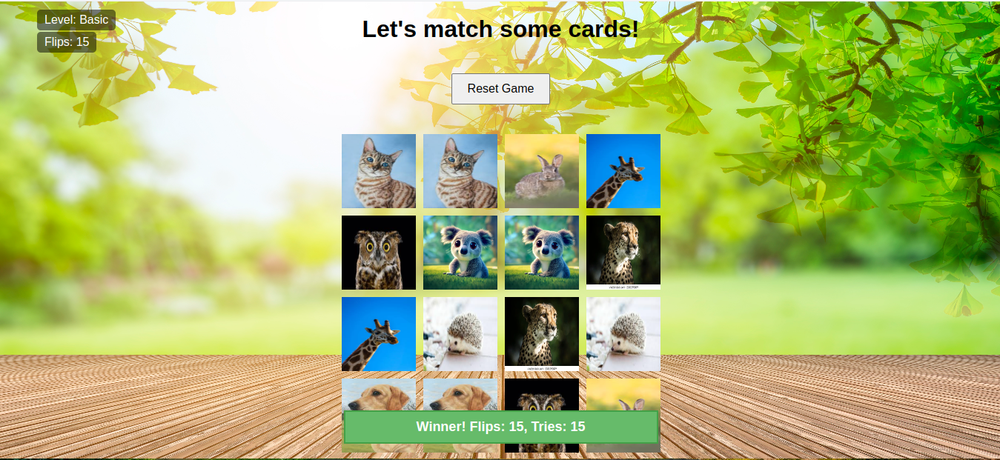

This project is for my personal developement skills to familiarize myself with  JavaScript, including DOM manipulation, event handling, and game logic.

# principe

Flipping over pairs of cards to find matching pairs.

